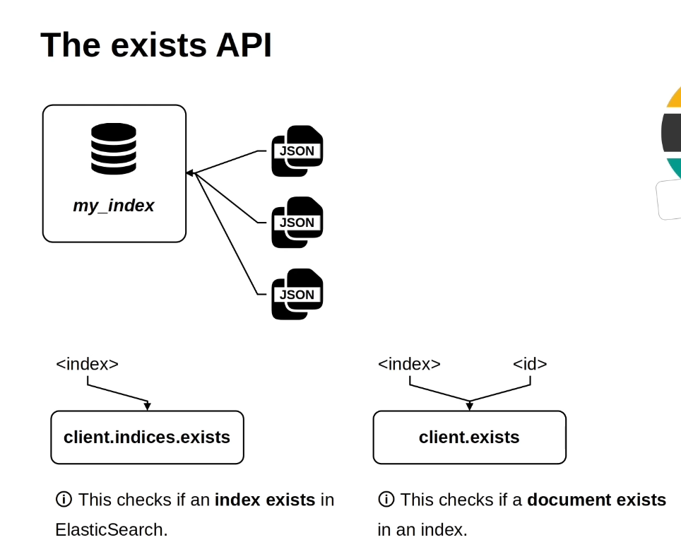
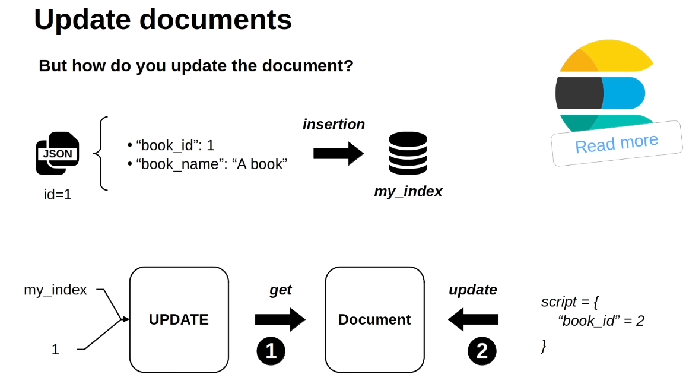
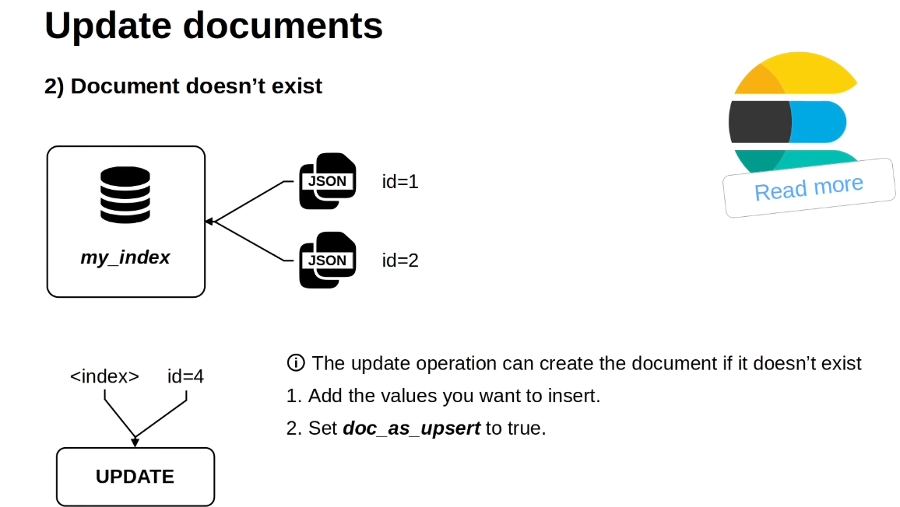

# APIs
---
## 1. Count
-   counts the documents in an indices
-   `Input:` index name
---
## 2. Exists
-   Used for checking if the document exists or not 
-   It is also used for checking if the index exists or not

---

## 3. Update
-   update the document present in the index
-   `Input:` 
    -   Index_name
    -   document_id

-   when you try to update the document which is Not present, then update method will create a document with specified id. But ypu need to do some following stuff

---

## 4.