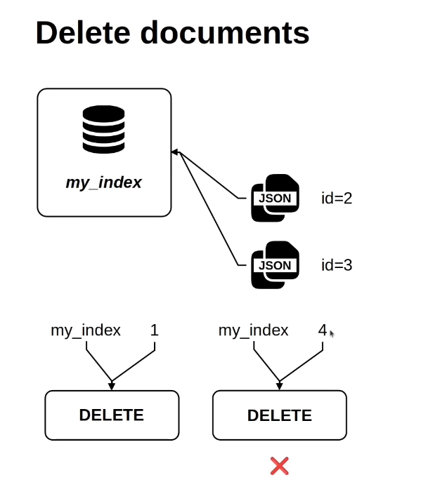

# Deleting Documents

- need two parameter
    1. `index_name`
    2. `document_id`

- if you don't provide a valid index or id then it will through an error.

---

For Code: <a href="./src/get_and_delete_document.ipynb">[click me]</a>
