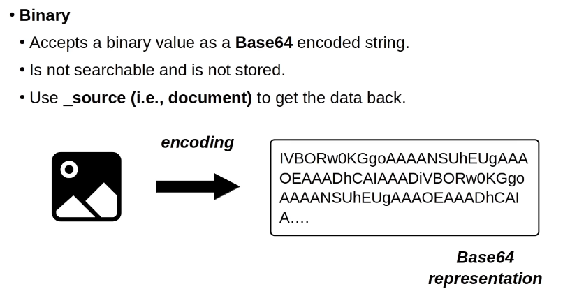
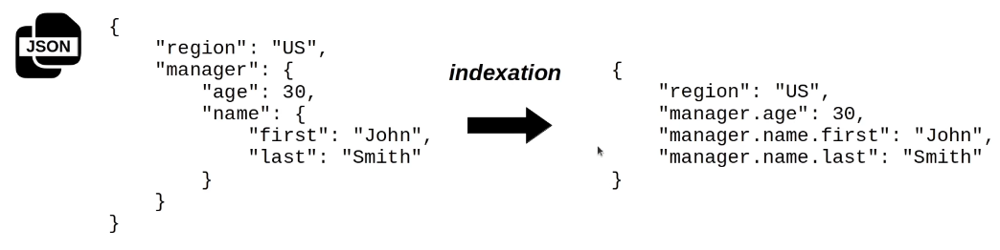
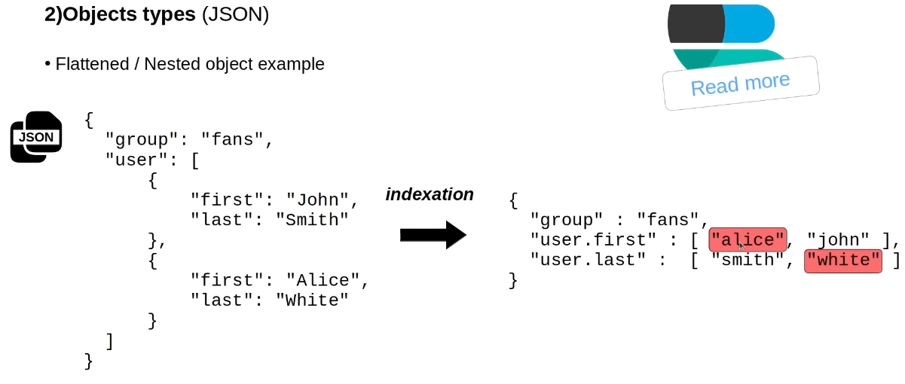

# Field Data-Types
---
## A. Common Data Types

### 1. Binary
-   Accepts a binary value as a Base64 encoded string
-   Is not searchable and is not stored (as it is too expensive to store).
-   Use `_source`(i.e., document) to get the data back.

### 2. Boolean 
-   (True/ False)
### 3. Binary
### 4. Numbers 
-   (long, integer, byte, short, etc)
### 5. Dates
### 6. Keyword 
- (IDs, email addresses, status codes, zip codes, etc.)

----
## B. Object types(JSON)
### 1.  `Object`

### 2.  `Flattened `
-   Efficient for deeply nested JSON objects
-   `Hierarchical structure in not preserved`

### 3.  `Nested`
-   Cases where you have `array of objects( like list of JSONs)`.
-   `Maintains relationships between the object's fields`

----
## C. Text Search Type

### 1. Text
-   Used for `full-text content`
-   Optimized for search

### 2. Completion

### 3. Search as you type

### 4. Annotated text
---
## D. Spatial data types
### 1. Geo point
-   latitude, longitude
### 2. Geo shape
-   list of Geo points
### 3. Point (Cartesian Point)
### 4. Shape (Cartesian Geometry)
---

---
For Code: refere > <a href="./src/field_data_types.ipynb">[Click me...]</a>
---