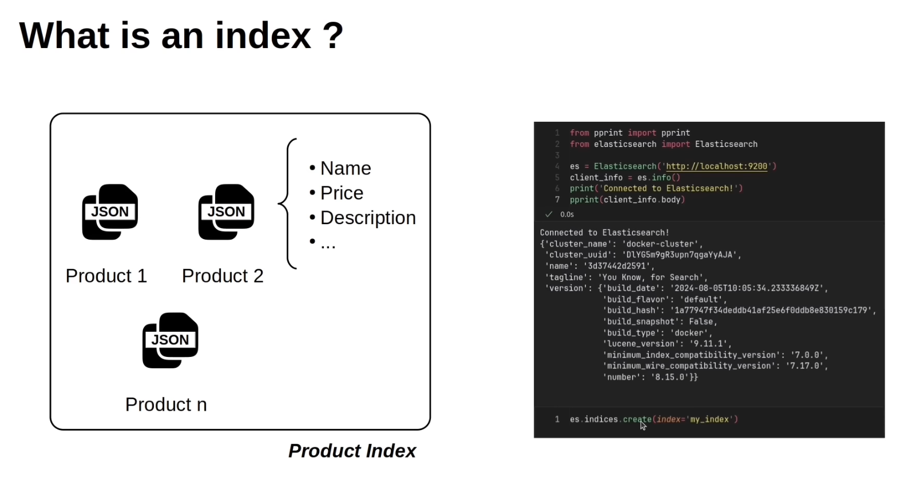
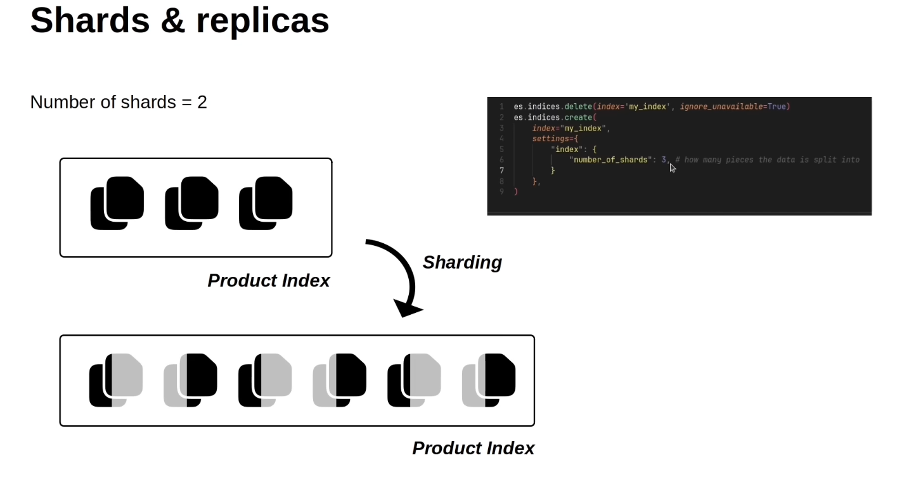
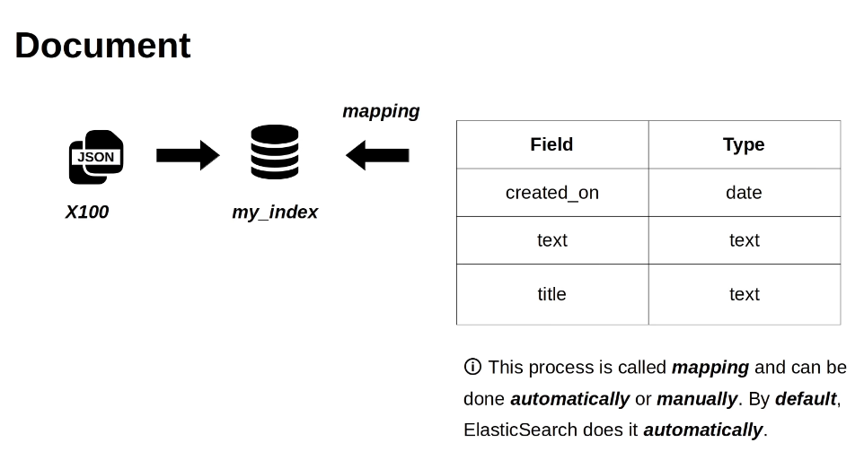

# terminologies

## Index
-   Index is a collection of objects that shares similar characteristics.



1. what is `Shards & replicas` ?
-   `shards` determines the `number of parts` in which a `document in an index` will be `broken down`


-    to change the number of shard you can change it with 
```python
es.indices.create(
    index="my_index",
    settings={
        "index":{
            "number_of_shards":3 # how many pieces the data is split into
        }
    }
)
```
2. what is `replica`?
-   replica determine the number of copies/ duplicates of index is maintained !
-   this makes the system more resilient 
-   It enables the parallel search and retrieval


for adding relica to the index, use
```python
es.indices.create(
    index="my_index",
    settings={
        "index":{
            "number_of_shards":3, # how many pieces the data is split into
            "number_of_replicas":2 # how many copies of data is maintained
        }
    }
)
```

3. `manual Mapping` (schema inforcement)
- mapping format
```json
{
    "properties": {
        "content": {
            "fields": {"keyword": {"ignore_above": 256, "type": "keyword"}},
            "type": "text",
        },
        "created_on": {"type": "date"},
        "title": {
            "fields": {"keyword": {"ignore_above": 256, "type": "keyword"}},
            "type": "text",
        },
    }
}
```
- it should be done before adding any document to the index. 
- it can be done why passing the mapping to the mapping parameter in 
```python
indices.create(index="index_name", mapping=mapping)
```
- or after creating the document mapping can be inforced using 

```python
indices.put_mapping(index="index_name", body=mapping)
```
4. `Inserting document`

- `JSON`: only json documnets is stored in elastic search
- the documents in an index must have `same structure`
<i> when we insert the document in the index `mapping of different field to their datatype` is` done automatically`.
- we can even `inforce the structure and fields and their datatypes
`

For code: Refer <a href="./src/create_index.ipynb">[click here..]</a>
---

## DATA-Types

Link: <a href="./field_data_types.md">[click here...]</a>


For code: refer <a href="./src/field_data_types.ipynb">[click me..]</a>

---

## Deleting documnet

Link: <a href="./deleting_document.md">[click here]</a>

---

## Get Document

Link: <a href="./get_document.md">[click here]</a>

---
## APIs

FOR CODE see : <a href="./src/apis.ipynb">[click me]</a>
For Notes of APIs: <a href="./apis.md">[click me]</a>

---

## Bulk APIs

For Code see: <a href="./src/bulk_api.ipynb">[click me]</a>

For Notes of APIs: <a href="./bulk_apis.md">[click me]</a>

---

# Search APIs

For code : <a href="./src/search_api.ipynb">[click me]</a>

For Notes of APIs: <a href="./search_apis.md">[click me]</a>


---

# 