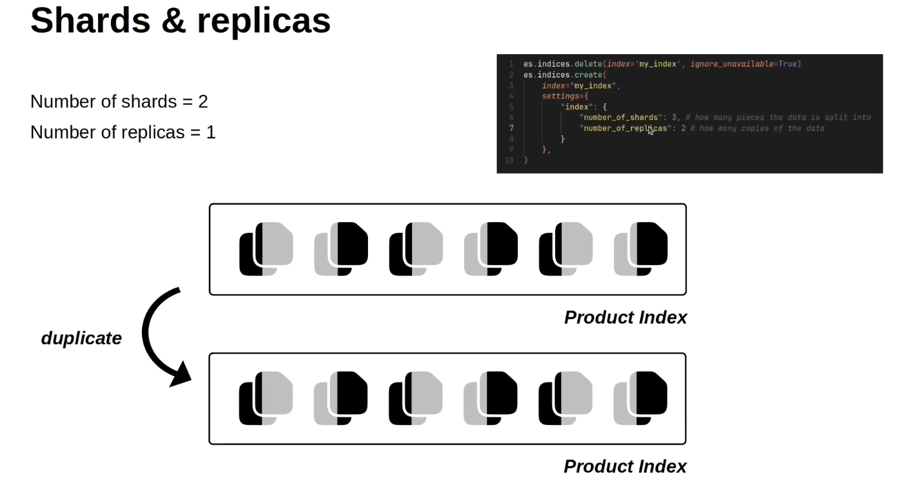

# terminologies

## Index
-   Index is a collection of objects that shares similar characteristics.


1. what is `Shards & replicas` ?
-   `shards` determines the `number of parts` in which a `document in an index` will be `broken down`


-    to change the number of shard you can change it with 
```python
es.indices.create(
    index="my_index",
    settings={
        "index":{
            "number_of_shards":3 # how many pieces the data is split into
        }
    }
)
```
2. what is `replica`?
-   replica determine the number of copies/ duplicates of index is maintained !
-   this makes the system more resilient 
-   It enables the parallel search and retrieval


for adding relica to the index, use
```python
es.indices.create(
    index="my_index",
    settings={
        "index":{
            "number_of_shards":3, # how many pieces the data is split into
            "number_of_replicas":2 # how many copies of data is maintained
        }
    }
)
```

3. 