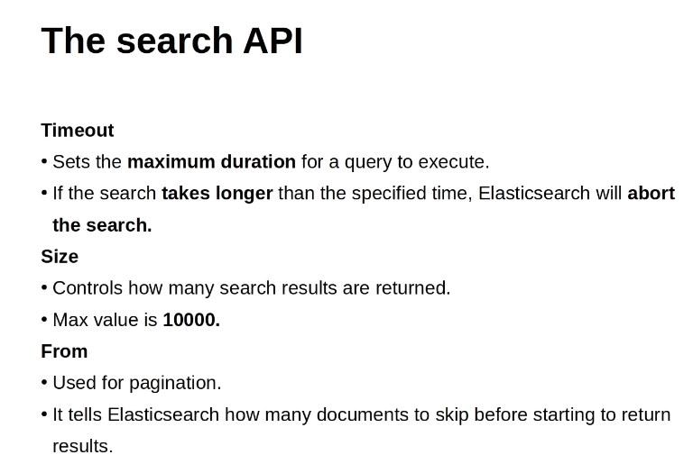
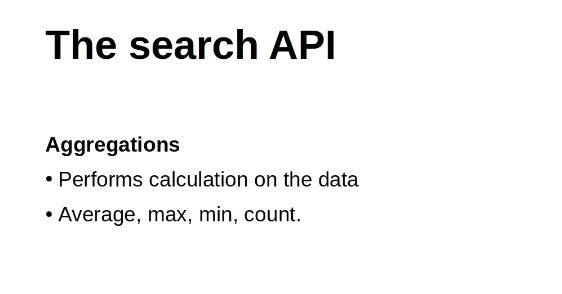
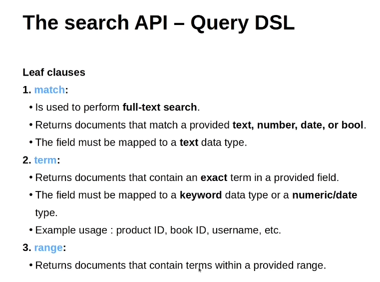
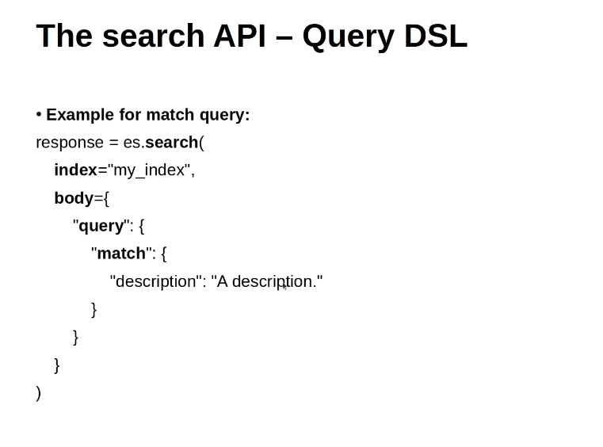
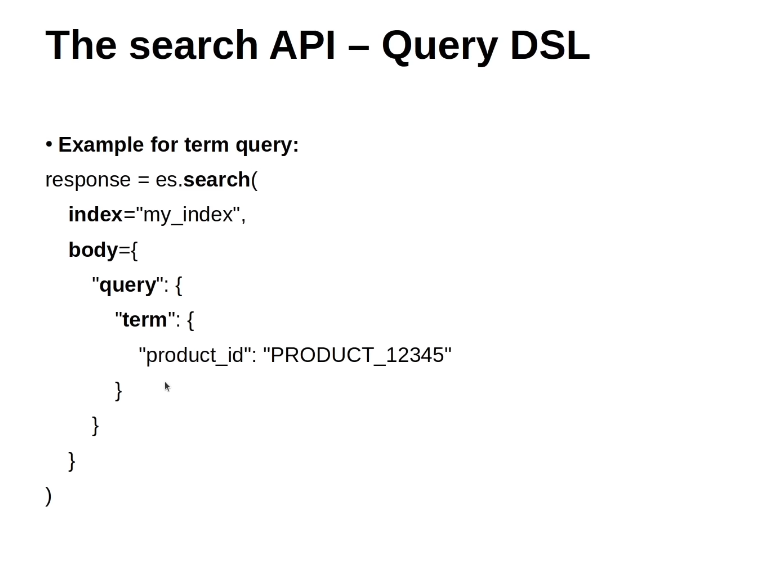
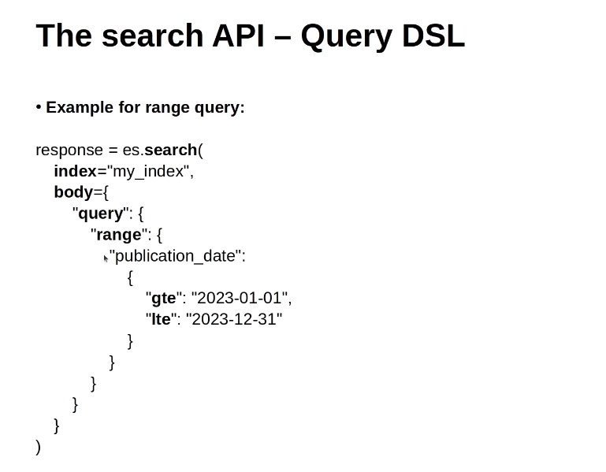
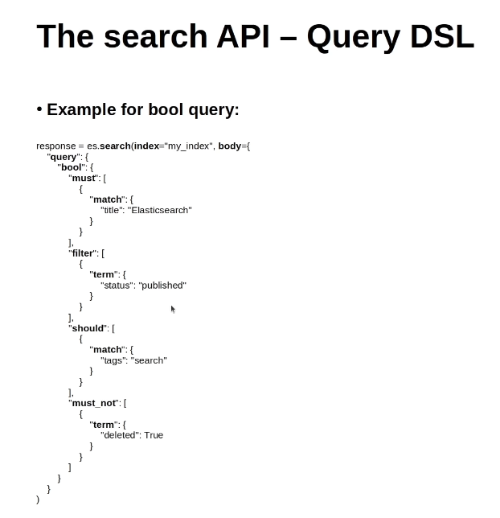

# Search APIs (most important)

It help in building :
-   Search Engines
-   Recommendation Systems
-   Real-time Dashboards
-   Log data Analysis

## Arguments

-   `index`: (possible values)
    -   index_name
    -   index_1,index_2  // comma seperated
    -   index* // using regular expression
    -   _all // for all the indices

-   `q`: 
    -   use it for simple searches
    -   uses the `Lucene` syntax

-   `query`:
    -   Use it for `Complex`, `structured` queries.
    -   Uses the `Query DSL` Language.

-   `timeout`, `size`, `from` :
    -  `Timeout`: 
        -   The maximum time to wait for a search request to complete.
        -   Time Units( seconds, milliseconds, days, etc. ).
        
    -   `Size`:
        -   Defines the number of hits(documents) to return.
        -   Default value is 10, it can be adjusted, maximum value can be 10000.
    
    -   `From`:
        -   Starting point from which to return search results (`pagination`).
        -   Useful if you want to implement `skip` functionality.

    

-   `Aggregations`:

---

##  Query DSLs
consists of two types of clauses:
-   Leaf clauses (match, term, or range)
-   Compound Clauses (bool)

### Leaf clauses:

1.  `Match`:
-   performs a `full-text search`
-   returns documents that match a provided `text`, `number`, `date`, or `bool`.
-   The field `must be mapped to a text datatype`

2.  `term`:
-   returns documents that contains an `exact` term in provided field.
-   The field must be mapped to a `keyword` data type or a `numeric/data` type.
-   Example usage: product_ID, book_ID, username, etc.

3.  `Range`:
-   Returns documents that contains terms within a provided range

### Compound Clauses
1.  `bool`:
-   Combines multiple queries using boolean logic:
    -   `must`, `filter`, `should`, `must_not`
-   The field must be mapped to a `text` data type.

